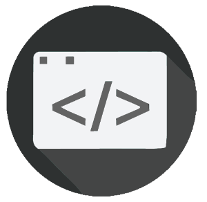

# VS Code KS Snippets

**Classic for Angular 8.0.0 release**

This extension for Visual Studio Code adds snippets for easy templates in HTML, CSS & TypeScript.

See the [CHANGELOG](CHANGELOG.md) for the latest changes

## Usage

Type "ks-" for generating optional snippets, press `enter`, and the snippet unfolds.

Alternatively, press `Ctrl`+`Space` (Windows, Linux) or `Cmd`+`Space` (macOS) to activate snippets from within the editor.

### TypeScript Snippets

| Snippet                      | Purpose                                                  |
| ---------------------------- | -------------------------------------------------------- |
| `ks-class-Product`           | Product model class                                      |
| `ks-remote-sync`             | synchronously remote demo GET request                    |
| `ks-remote-async-callback`   | asynchronously remote demo GET request using callback    |
| `ks-remote-async-promise`    | asynchronously remote demo GET request using promise     |
| `ks-remote-async-observer`   | synchronously remote demo GET request                    |
| `ks-dummy-array`             | dummy data array with 3 products                         |
| `ks-service-sync`            | invoke remote GET reuest synchronously                   |
| `ks-service-async-callback`  | invoke remote GET reuest asynchronously using callback   |
| `ks-service-async-callback`  | invoke remote GET reuest asynchronously using callback   |
| `ks-service-async-observable`| invoke remote GET reuest asynchronously using observable |

### HTML Snippets

| Snippet              | Purpose                                             |
| -------------------- | --------------------------------------------------- |
| `ks-html-loading`    | lodaing gif format with conditional `ngif`          |
| `ks-html-table`      | `<table>` implementation with `ngFor`               |

### CSS Snippets

| Snippet              | Purpose                                             |
| -------------------- | --------------------------------------------------- |
| `ks-css-main.css`    | main.css setup                                      |
| `ks-css-table-1`     | table css desing #1: lightblue & lightcoral         |
| `ks-css-table-2`     | table css desing #1: lightcyan & lightskyblue       |
| `ks-css-app.css`     | classic section within header, footer, main & aside |

## Java Snippets

| Snippet                      | Purpose                                                  |
| ---------------------------- | -------------------------------------------------------- |
| `ksj-RunTimeMethod`          | Method to check code run time                            |
| `ksl-RunTimeCode`            | Code to use run time method                              |
| `ksj-SingletonClass`         | Singleton class thread safe example                      |

### Spring Snippets

| Snippet                      | Purpose                                                  |
| ---------------------------- | -------------------------------------------------------- |
| `kss-SpringMain`             | Spring main class initialization                         |
| `kss-UserTable`              | User table (bean class) initialization                   |
| `kss-UserRepository`         | User repository class initialization                     |
| `kss-UserService`            | User service class initialization                        |
| `kss-UserController`         | User controller class initialization                     |
| `kss-SwaggerClass`           | Swagger class initialization                             |

### Pom.xml Snippets

| Snippet                      | Purpose                                                  |
| ---------------------------- | -------------------------------------------------------- |
| `ksp-MySqlDependecie`        | MySql Dependecie Initialization                          |
| `ksp-SwaggerDependecie`      | Swagger Dependecie Initialization                        |

### Application.properties Snippets

| Snippet                      | Purpose                                                  |
| ---------------------------- | -------------------------------------------------------- |
| `ksa-MySqlConfiguration`     | Application properties mysql configuration code          |

## Extension Installation

01. Install Visual Studio Code 1.41 or higher
02. Launch Code
03. From the command palette `Ctrl`-`Shift`-`P` (Windows, Linux) or `Cmd`-`Shift`-`P` (OSX)
04. Select `Install Extension`
05. Choose the extension
06. Reload Visual Studio Code
  - important make sure to install bootstrap for angular.

## Bootstrap Installation
01. From the current project open terminal in visual studio code and run `npm install @ng-bootstrap/ng-bootstrap`
02. From the current project open terminal in visual studio code and run `npm install bootstrap jquery`

From the current project open terminal in visual studio code and run `npm install ngx-bootstrap`
`npm install jquery`
